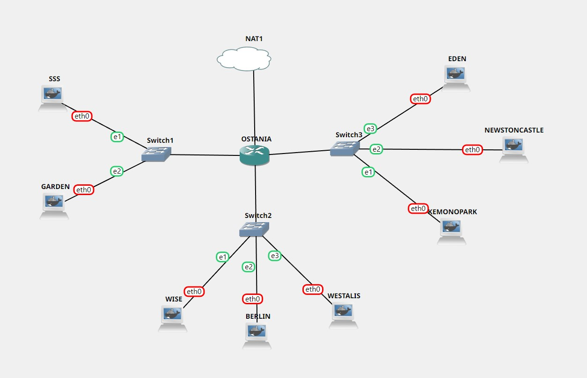

# Jarkom-Modul-3-D07-2022

## Kelompok D07

| **No** | **Nama**                     | **NRP**    |           **TUGAS**        |
| ------ | -----------------------------| ---------- |----------------------------|
| 1      | Reza Maranello Alfiansyah    | 5025201071 |  Mengerjakan Soal          |
| 2      | Nuzul Abatony                | 5025201107 |  Mengerjakan Soal          |
| 3      | Muhammad Raihan Athallah     | 5025201206 |  Membuat Lapres            |


# TOPOLOGI


# CONFIGURATION

Wise		= Enies Lobby (DNS Server)

Westalis	= Jipangu (DHCP Server)

Berlint		= Water 7 (Proxy Server (1))

Ostania	= Foosha (DHCP Relay (2))

Eden		= Skypea (Web Server)

### OSTANIA
```
auto eth0
 iface eth0 inet dhcp

auto eth1
iface eth1 inet static
	address 192.188.1.1
	netmask 255.255.255.0

auto eth2
iface eth2 inet static
	address 192.188.2.1
	netmask 255.255.255.0

auto eth3
iface eth3 inet static
	address 192.188.3.1
	netmask 255.255.255.0
```
### SSS
```
auto eth0
iface eth0 inet static
address 192.188.1.2
netmask 255.255.255.0
gateway 192.188.1.1
```
### GARDEN
```
auto eth0
iface eth0 inet static
address 192.188.1.3
netmask 255.255.255.0
gateway 192.188.1.1
```
### WISE
```
auto eth0
iface eth0 inet static
address 192.188.2.2
netmask 255.255.255.0
gateway 192.188.2.1
```
### BERLINT
```
auto eth0
iface eth0 inet static
address 192.188.2.3
netmask 255.255.255.0
gateway 192.188.2.1
```
### WESTALIS
```
auto eth0
iface eth0 inet static
address 192.188.2.4
netmask 255.255.255.0
gateway 192.188.2.1

```
### EDEN
```
auto eth0
iface eth0 inet static
address 192.188.3.2
netmask 255.255.255.0
gateway 192.188.3.1

```
### NEWSTONCASTLE
```
auto eth0
iface eth0 inet static
address 192.188.3.3
netmask 255.255.255.0
gateway 192.188.3.1
```
### KEMONOPARK
```
auto eth0
iface eth0 inet static
address 192.188.3.4
netmask 255.255.255.0
gateway 192.188.3.1
```

# JAWABAN SOAL
### 1. Semua client yang ada HARUS menggunakan konfigurasi IP dari DHCP Server
### /root/.bashrc
### Ostania (DHCP Relay (2))
```
iptables -t nat -A POSTROUTING -o eth0 -j MASQUERADE -s 192.188.0.0/16
    cat /etc/resolv.conf
    echo 'nameserver 192.168.122.1' > /etc/resolv.conf     # opsional
    apt-get update

```
### Westalis (DHCP Server)
```
echo ‘nameserver 192.168.122.1’ > /etc/resolv.conf
   apt-get update

```
### Berlint (Proxy Server (1))
```
echo ‘nameserver 192.168.122.1’ > /etc/resolv.conf
    apt-get update
```
### Wise (DNS Server)
```
echo ‘nameserver 192.168.122.1’ > /etc/resolv.conf
   apt-get update
```
### Eden (Web Server)
```
 echo ‘nameserver 192.168.122.1’ > /etc/resolv.conf
   apt-get update
```

#### Wise (DNS Server)
```
 apt-get update
apt-get install bind9 -y
service bind9 start
service bind9 status

```
#### Westalis (DHCP Server)
```
apt-get update
apt-get install isc-dhcp-server -y
```
`nano /etc/default/isc-dhcp-server` dan tambahkan
```
INTERFACES=”eth0”
```
#### Berlint (Proxy Server)
```
apt-get update
apt-get install squid -y
service squid start
service squid status
```
#### Ostania (DHCP Relay )
```
apt-get update #opsional
apt-get install isc-dhcp-relay -y
nano /etc/default/isc-dhcp-relay
```
  Kemudian isi dengan:
```
SERVERS=”192.188.2.4"
INTERFACES="eth1 eth2 eth3"
OPTIONS="”
```
  Dan lakukan
```
service isc-dhcp-relay restart
```
### 3. Client yang melalui Switch1 mendapatkan range IP dari [prefix IP].1.50 - [prefix IP].1.88 dan [prefix IP].1.120 - [prefix IP].1.155
### 4. Client yang melalui Switch3 mendapatkan range IP dari [prefix IP].3.10 - [prefix IP].3.30 dan [prefix IP].3.60 - [prefix IP].3.85
#### Westalis (DHCP Server)
```
nano no3-4.sh
```
  Kemudian isi dengan:
```
echo -e "
subnet 192.188.1.0 netmask 255.255.255.0 {
    range 192.188.1.50 192.188.1.88;
    range 192.188.1.120 192.188.1.155;
    option routers 192.188.1.1;
    option broadcast-address 192.188.1.255;
    option domain-name-servers 192.188.2.2;
    default-lease-time 300;
    max-lease-time 6900;

}
subnet 192.188.3.0 netmask 255.255.255.0 {
    range 192.188.3.10 192.188.3.30;
    range 192.188.3.60 192.188.3.85;
    option routers 192.188.3.1;
    option broadcast-address 192.188.3.255;
    option domain-name-servers 192.188.2.2;
    default-lease-time 600;
    max-lease-time 6900;
}
" > /etc/dhcp/dhcpd.conf
```
```
nano /etc/dhcp/dhcpd.conf
```
pada line ke 17 masukan tanda petik “ sebelum dan sesudah example.org (“example.org”)
dan lakukan
```
service isc-dhcp-server restart
```
### 5. Client mendapatkan DNS dari WISE dan client dapat terhubung dengan internet melalui DNS tersebut
#### WISE
```
nano /etc/bind/named.conf.options
```
  dan tambahkan:
```
forwarders {
        192.168.122.1;
    };
    allow-query{any;};
```
dan mengcommand 
```
// dnssec-validation auto;
```
lalu lakukan
```
service bind9 restart
```

### 6. Lama waktu DHCP server meminjamkan alamat IP kepada Client yang melalui Switch1 selama 5 menit sedangkan pada client yang melalui Switch3 selama 10 menit. Dengan waktu maksimal yang dialokasikan untuk peminjaman alamat IP selama 115 menit.
#### Westalis

`nano /etc/dhcp/dhcpd.conf` dan tambahkan pada subnet 192.188.1.0

```
default-lease-time 300;
max-lease-time 6900;

```
  dan tambahkan pada subnet 192.188.3.0
```
default-lease-time 600;
max-lease-time 6900;

```
lalu lakukan
```
service isc-dhcp-server restart
```

### 7. Loid dan Franky berencana menjadikan Eden sebagai server untuk pertukaran informasi dengan alamat IP yang tetap dengan IP [prefix IP].3.13

#### WESTALIS
`nano /etc/dhcp/dhcpd.conf` dan tambahkan 
```
host Eden {
        hardware ethernet 7a:76:36:74:f5:48;
        fixed-address 192.188.3.24;
    }
```
  Lalu Lakukan `service isc-dhcp-server restart`
#### EDEN
`nano /etc/dhcp/dhcpd.conf` dan tambahkan 
```
host Eden {
        hardware ethernet 7a:76:36:74:f5:48;
        fixed-address 192.188.3.24;
    }
```


### 8. SSS, Garden, dan Eden digunakan sebagai client Proxy agar pertukaran informasi dapat terjamin keamanannya, juga untuk mencegah kebocoran data. 


Note: 

Sebelum melakukan konfigurasi proxy pada client, server proxy harus dikonfigurasi terlebih dahulu (no. 9 dan seterusnya).


#### Konfigurasi Client Proxy SSS
```
> export http_proxy="http://192.188.2.3:8080"
```
#### Konfigurasi Client Proxy Garden
```
> export http_proxy="http://192.188.2.3:8080"
```
#### Konfigurasi Client Proxy Eden
```
> export http_proxy="http://192.188.2.3:8080"
```

### 9. Jadikan Berlint sebagai Proxy Server sehingga dapat mengakses internet. 

### Install proxy squid pada Berlint
```
apt-get update
apt-get install squid
service squid start

service squid status

```
### Konfigurasi squid
#### backup file config default squid
```
> mv /etc/squid/squid.conf /etc/squid/squid.conf.bak
```
#### buat konfigurasi squid baru pada file `/etc/squid/squid.conf`
#### pada file config baru dengan command
```
> nano /etc/squid/squid.conf
```
masukkan script:
```
http_port 8080
visible_hostname Berlint
```
#### Restart Script
```
> service squid restart
```

### 10. Jadikan Berlint sebagai Proxy Server sehingga dapat mengakses internet. 

### Berlint
`nano /etc/squid/acl.conf` dan tambahkan
```
acl UNAVAILABLE_WORKING time MTWHF 08:00-17:00
```
`nano /etc/squid/acl.conf` dan masukkan
```
include /etc/squid/acl.conf
http_port 8080
http_access deny UNAVAILABLE_WORKING
http_access allow all
visible_hostname Berlint
```
Kemudian lakukan `service squid restart`


### 11. client hanya dapat mengakses domain loid-work.com dan franky-work.com (IP tujuan domain dibebaskan). Saat akses internet dibuka, client dilarang untuk mengakses web tanpa HTTPS. (Contoh web HTTP: http://example.com)

### WISE
`nano /etc/bind/named.conf.local` dan masukan
```
zone "loid-work.com" {
  type master;
  file "/etc/bind/jarkom/loid-work.com";
};

zone "franky-work.com" {
  type master;
  file "/etc/bind/jarkom/franky-work.com";
};

```
`mkdir /etc/bind/jarkom/` 
`nano /etc/bind/jarkom/loid-work.com` dan masukkan
```
$TTL 604800
@ IN SOA loid-work.com. root.loid-work.com. (
                20211108 ; Serial
                604800 ; Refresh
                86400 ; Retry
                2419200 ; Expire
                604800 ) ; Negative Cache TTL
;
@ IN NS loid-work.com.
@ IN A 192.188.2.3
@ IN AAAA ::1
www IN CNAME loid-work.com.

```
`nano /etc/bind/jarkom/franky-work.com` dan masukkan
```
$TTL 604800
@ IN SOA franky-work.com. root.franky-work.com. (
                20211108 ; Serial
                604800 ; Refresh
                86400 ; Retry
                2419200 ; Expire
                604800 ) ; Negative Cache TTL
;
@ IN NS franky-work.com.
@ IN A 192.188.2.3
@ IN AAAA ::1
www IN CNAME franky-work.com.

```
### BERLINT
`nano /etc/squid/squid.conf` dan masukkan
```
http_port 5000
    visible_hostname loid-work.com
    visible_hostname franky-work.com
    http_access allow all
```
Kemudian lakukan `service squid restart`

### 12. Agar menghemat penggunaan, akses internet dibatasi dengan kecepatan maksimum 128 Kbps pada setiap host (Kbps = kilobit per second; lakukan pengecekan pada tiap host, ketika 2 host akses internet pada saat bersamaan, keduanya mendapatkan speed maksimal yaitu 128 Kbps) 

### BERLINT
`nano /etc/squid/acl-bandwidth.conf` dan masukan
```
delay_pools 2
delay_class 1 1
delay_class 1 2
delay_access 1 allow all
delay_access 2 allow all
delay_parameters 2 128000/128000 128000/128000
```
`nano /etc/squid/squid.conf` dan masukkan
```
include /etc/squid/acl-bandwidth.conf
```
Kemudian lakukan `service squid restart`
